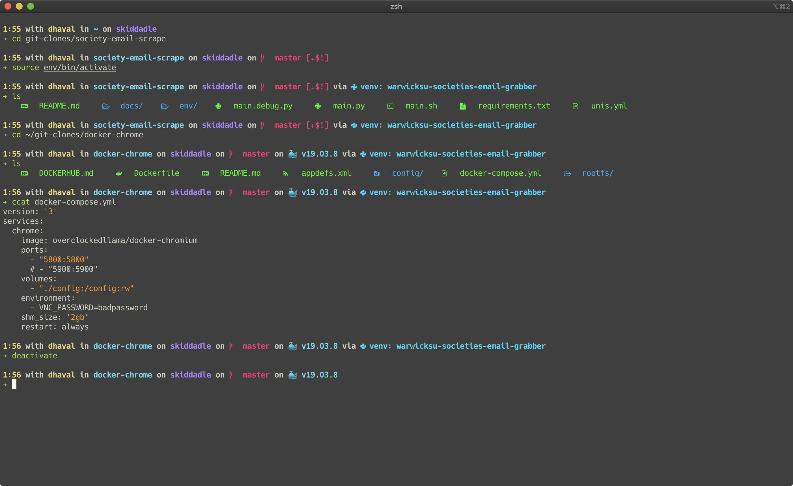
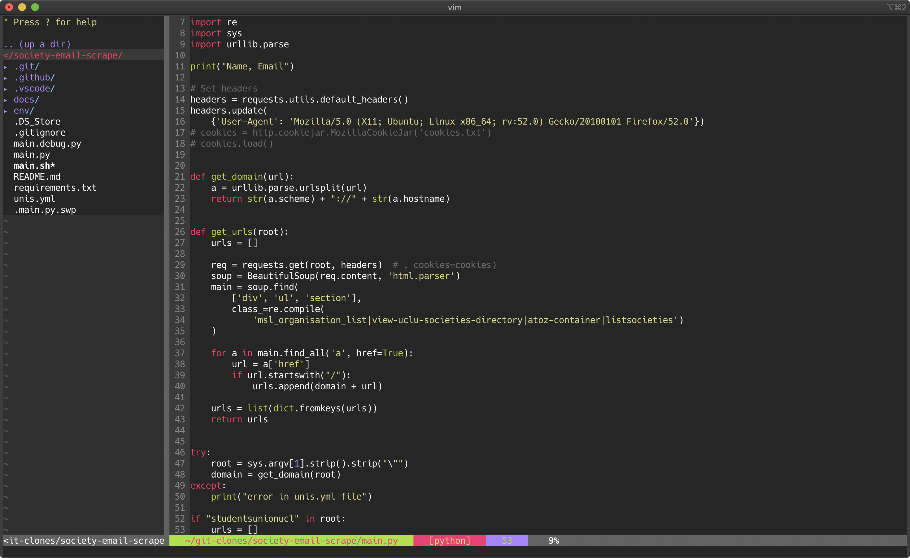

# dotfiles

Welcome to muh dotfiles repository. Here I store all muh configs

## How to install

```yaml
Universal: 
 sudo curl -fLo /bin/yadm https://github.com/TheLocehiliosan/yadm/raw/master/yadm && 
 sudo chmod a+x /bin/yadm &&
 yadm clone https://github.com/overclockedllama/dotfiles.git

Mac: 
 brew install yadm &&
 yadm clone https://github.com/overclockedllama/dotfiles.git

Arch (fresh install):
 pacman -Syu sudo git --noconfirm &&
 sudo curl -fLo /bin/yadm https://github.com/TheLocehiliosan/yadm/raw/master/yadm && 
 sudo chmod a+x /bin/yadm &&
 yadm clone https://github.com/overclockedllama/dotfiles.git

Arch (AUR): 
 yay -Syu yadm-git &&
 yadm clone https://github.com/overclockedllama/dotfiles.git

Debian UNSTABLE/Ubuntu 20.04+: 
 sudo apt install yadm &&
 yadm clone https://github.com/overclockedllama/dotfiles.git
```

P.S. Just ignore the GPG password prompt (by pressing cancel or control c), as it's for my personal SSH keys

## Errors
### When cloning
If you encounter any error when cloning, run `yadm stash`, then reclone with `yadm clone -f https://github.com/overclockedllama/dotfiles.git`
### Running bootstrap script
If you encounter any errors when running the bootstrap script, you can always rerun it with `./.config/yadm/bootstrap`
### Others
Please report any issues you have [here](https://github.com/overclockedllama/dotfiles/issues)

Congratulations, you now have muh ultimate rice setup for 1337 h4xx0r5 only


## Screenshots


